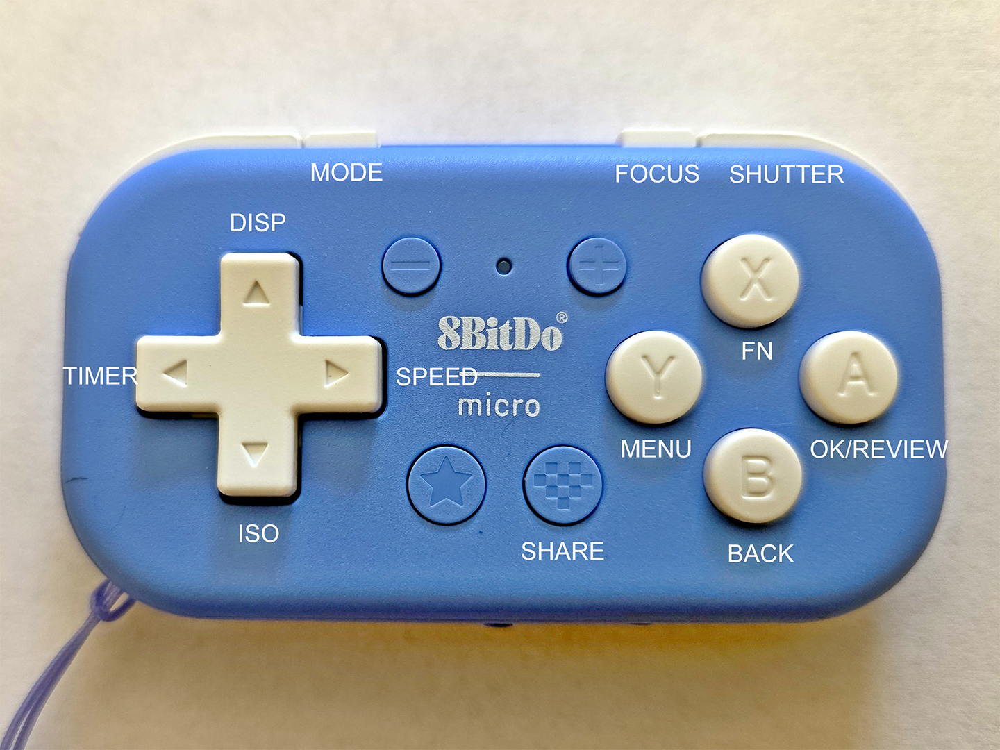
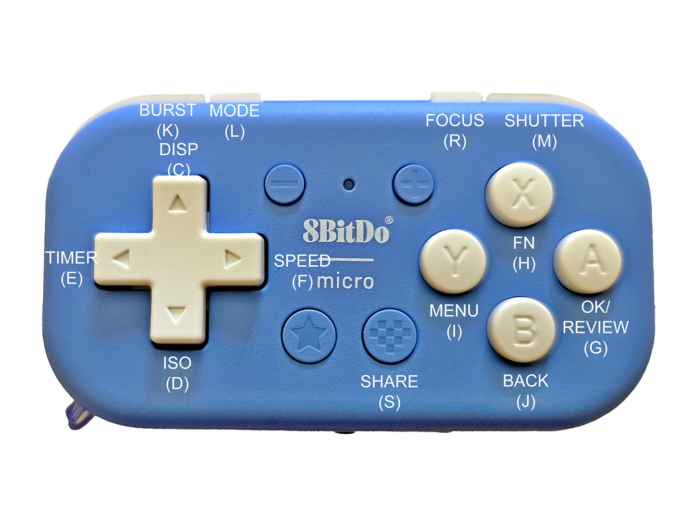

# A3DCamera
A personal 3D Camera Android App Project

This is a personal camera project intended for 3D photography hobbyists and experimenters.
The app runs on the Xreal Beam Pro device and takes 3D photos exclusively. It is not intended to replace the native camera app.

It is a starting point for special purpose **_experimental_** 3D camera apps using the Xreal Beam Pro and Leia LumePad 2 cameras.
It's a software playground for experimenting. See Experiments section below.

## Design Goals
### Use Cases
The intended uses for the app are situations where the camera is not in your hands and the screen cannot or should not be touched. 
Specific uses I would like to have with a 3D camera app are:

* 3D Photo Booth (work in progress)
* 3D live view, photo capture, or photo viewing using any stereoscope
* Live Anaglyph 3D demonstrations of the stereo window (work in progress)
* Remote control of the camera using Bluetooth or a local WiFi network (work in progress)
* Simultaneous multiple 3D cameras remote control
* Sharing photos via email, for direct printing SBS or Anaglyph, or for review and alignment using 3D apps like [3DSteroidPro](https://play.google.com/store/apps/details?id=jp.suto.stereoroidpro&hl=en_US).

The display of the 3D parallel L/R image should be centered on the display and no larger than 130 cm wide for a stereoscope or for free-viewing the image to minimize eye strain. 
There is a display mode where only the stereo image appears without controls or other information.

### Camera App Design
For the above uses cases the app requires remote key control of its functions and not with the touch screen.

With the remote control requirements for the app, a minimum Bluetooth controller is needed. 
I want to keep the GUI mostly for viewing 3D images and for showing brief information status or settings.
Therefore only key input will determine the camera operation.

I chose the [8BitDo](https://www.8bitdo.com) Micro Bluetooth game key controller in its Android mode. With this controller's 15 keys many camera functions can be set or controlled with a single key.
The 8BitDo Micro is sold as key programmable in its keyboard mode, but I found it impossible to modify key codes using the manufacturer's [Google Play Store app](https://play.google.com/store/apps/details?id=com.abitdo.advance). 
Fortunately the out of the box Android key mode is good enough.

There is also a keyboard mode with the 8BitDo Micro. See the key diagram below. 
The app uses these equivalent keys so a standard Bluetooth keyboard device can also be used simulatneously with the game controller.
With keyboard input, a command line interface is present for debugging and camera parameter setup until a Settings GUI feature is coded.

## Camera Functions
### Camera Mode
Captures 3D photos only. A 3D video option is not implemented.

### Focus
The camera is set to fixed focus of approximately 166 cm, which is the hyper focal distance of the lens.
Note the code uses 0.60356647 diopters to set the hyper focal distance.
The hyper focal distance in cm is one divided by this value.
It is considered sharp from 83 cm (half the hyperfocal distance) and beyond.
The camera reports its LENS_FOCUS_DISTANCE_CALIBRATION as APPROXIMATE.
The focus distance options are hyper focal 1.66 meters, photo booth 1 meter, and macro 100 cm. Macro may not be useful for 3D but shows how the lens can focus close.

### Exposure
Auto exposure sets the best subject lighting by automatically changing shutter speed and ISO. There is no manual exposure control implemented. 
The photographer can set the type of exposure metering: Frame Average, Center Weighted, and Spot Metering.

### Image Storage
The app stores image files in the "Pictures/A3DCamera" folder. The base folder can be changed to "DCIM/A3DCamera" in the code.

The app stores 3D photos in several formats. Left and Right Camera images are stored respectively as "_l" and "_r" suffix filename jpg files.
Side by Side parallel left and right images are stored as "_2x1" suffix filename jpg files.
Anaglyph 3D images are stored as "_ana" suffix filename jpg files.

* The A3DCamera folder stores the SBS photos.
* The A3DCamera/Anaglyph subfolder stores the Anaglyph photos.
* The A3DCamera/LR subfolder stores the single left and right photos.

Left and right images contain limited EXIF capture information: for example- IMG20250904_r.jpg f2.2, 1/3 second, 2.16mm, ISO413
Each camera photo captured is 4080 x 3072 pixels, the full maximum sensor size of each left and right camera. Note the aspect ratio is not 4:3.

### Display
The app display is a centered viewfinder sized to permit use of stereoscopic "free-viewing". This is a learned eye relaxing technique you can use to help see your subject in 3D with parallal side by side left and right eye images. 
See 
[Learning To Free View](https://stereoscopy.blog/2022/03/11/learning-to-free-view-see-stereoscopic-images-with-the-naked-eye/).

When free-viewing I use a pair of +4.0 reading glasses to get closer to the screen. A +5.0 reading glasses would be ideal, if I could find one without lens distortion. 

The SBS display is sized at 130 mm for viewing in a stereoscope.

The app does not vertically align the left and right images nor adjust the stereo window in Live view mode. As a hobbyist app the user is encouraged to use [Stereo Photo Maker (English)](https://stereo.jpn.org/eng/stphmkr/) 
to align left and right images vertically, correct any horizontal perspective distortion, and set the most pleasing stereo window.

The app implements a image review feature by launching a separate app like 3DSteroidPro.

When using the Command Line feature below you can set the vertical misalignment and the stereo window to your preference.
These values persist after app restart and adjust the saved photos, except for single left and right photos.

### Camera Control
#### On Camera
Take photos with the camera key or volume up key upon key release. There is no touch screen photo capture implemented.

Use the volume down on key release to review the last photo taken. The Review function launches the [3DSteroid Pro (StereoRoidPro)](https://play.google.com/store/apps/details?id=jp.suto.stereoroidpro&hl=en_US)
app by default to view the photo.
If this app is not installed, you can select the app you will use for review.

#### Wired Remote Control
A wired USB-C connected Android keyboard can control the camera with keys similar to wireless keyboards or game controllers.

#### Bluetooth Remote Control
Here is the current key mapping for a 8BitDo Bluetooth game controller in Android mode. The controller must be paired with the Beam Pro. 
A Bluetooth Android keyboard may also be used, but the app needs an update for a normal keyboard to work. Not all function keys are working.

* SHUTTER - Take a photo on key release. In Photo Booth mode show count down seconds delay.
* FOCUS   - Cycle through fixed focus distances: Hyperfocal, Photo Booth, Macro
* MODE    - Select Auto, Manual, and Shutter Priority (only Auto implemented)
* BURST   - Start continous photo capture at about 1 photo per second until the key is pressed and released again, or 60 images captured. In Photo Booth mode take only 4 images.
* DISP    - Toggle change Review display mode (SBS,  Anaglyph, L/R) (Not implemented for either Live view or Review mode)
* TIMER   - Set 3 second delay time to take a photo or burst in Photo Booth mode. Toggle no delay or Photo Booth.
* ISO     - Set the ISO (not implemented)
* SPEED   - Set the Shutter speed (not implemented)
* FN      - Cycle through exposure metering: Frame Average, Center Weighted, Spot Metering
* MENU    - Settings, etc. not implemented
* BACK    - Only active with menu, not implemented
* OK/REVIEW - Review the last photo taken in [3DSteroid Pro (StereoRoidPro)](https://play.google.com/store/apps/details?id=jp.suto.stereoroidpro&hl=en_US) or another viewer. OK function for menus and setting when camera is not active
* SHARE    - Share the last photo taken with Email, Messaging, Photo Viewing, Printer, etc. apps.

The app can also be controlled with a WiFi ASCII keyboard. Here are the Android keyboard keys matching the function keys of the 8BitDo Micro controller when switched to keyboard mode:

### Limitations
Captured images are on par in quality with the native camera app. However, with this camera images may still need adjustments for vertical alignment, horizontal perspective, contrast, color saturation, and sharpening.

Color balance adjustments are not implemented. Exposure lock is not implemented.

There are no camera leveling, tilt, or subject distance suggestions from the app.

## Usage
1. I discovered my camera lens vertical alignment is only off by 12 pixels so that live free-viewing is possible without eye strain for me. But the camera can not be too close to the subject.
2. Distance to the subject should be about 1.5 meter to match the 50mm camera lens interaxial separation distance.
3. Synchronization of the camera lens shutters is not known. However the shutter speed is automatically set by the camera so motion blur is possible.
4. I use a Bluetooth remote to take photos instead of the button keys on the camera. This requires pairing with a remote controller or keyboard.

## App Download Link
Latest version:
[Version 1.5 A3DCamera Android app](https://drive.google.com/file/d/1IIXaQYrzeHks_mF9WRLy_3Vlho43zcuf/view?usp=sharing)

[Version 1.4 A3DCamera Android app](https://drive.google.com/file/d/1xkNVHQ7EOTipQxIqTqoDuHsepO7f5MxE/view?usp=drive_link)

Download the apk file into the XBeam Pro "Downloads" folder. Use the "Files" app to find and click on the A3DCamera apk file in the Downloads folder to install it. 
You will be asked to scan the file for security, respond yes.

My Beam Pro is in developers mode, but you do not have to be in that mode to install.

To enter developer mode, press the Settings -> About This device -> Build number (key) 7 times to enter this mode.
In developer mode, use Settings -> System -> Developer options to turn on USB debugging and use Android Studio or Processing.org Android Mode SDK to download an app.

## Command Line Debug
There is no GUI for setting camera parameters. The app implements a limited command line interface to set and save some parameters.

After connecting an Android keyboard to the app, the '/' (forward slash) key will show a prompt line to enter a command. Press the enter key to complete the command and see the results.

The following commands are coded:
1. /p=nnn  This sets the stereo window parallax adjustment (offset). The value comes from Stereo Photo Maker auto alignment of a sample left and right image from the XBP. nnn is the horizontal alignment after auto alignment. Example /p=212
2. /p  Show the horizontal parallax offset value.
3. /v=nnn  This value corrects the vertical alignment of a sample left and right image. nnn is the vertical alignment value after performing an auto alignment. This value can be positive or negative. Example /v=-12
4. /v  Show the vertical alignment offset value.

These two commands do not affect the live view image, but do change the alignment of stored photos for SBS and anaglyph.

## Software Issues
1. The XBP should be held horizontally when starting to make sure the camera starts. Otherwise a blank screen will appear. Exit the app with the navigation bar.
2. There is no exit key implemented yet. To exit the app, swipe from the right edge to the left, to show the navigation bar. Press the box or circle to exit (but not close the app).

## Stretch Goals
Turn off the display, while allowing the camera to continue functioning with remote control. Blanking the screen is for photographing wild life without disturing them. 
Blanking the screen may also conserve battery power with long interval timer captures.

Set image capture aspect ratio: 4:3, 16:9 and 1:1.

Anaglyph Live view mode

Time Interval captures.

A GUI interface: Settings menu, etc.

## Experiments
#### WiFi Remote Control
The app can listen for UDP broadcast messages to control the camera. Only shutter control is working.
This feature can be used to trigger multiple Beam Pro  cameras at the same time. This is working, but is turned off for now and is a work in progress.

An Android app at [RemoteCapture ](https://github.com/ajavamind/RemoteCapture) can trigger broadcast messages.

You can also simultaneously trigger any Android device running the [MultRemoteCamera app](https://sourceforge.net/p/multi-remote-camera/wiki/Home/) Android app.
I created this app by modifying the Open Camera (open soucre) app several years ago. My objective then was to use two phones for stereo photography.
It reqires a local WiFi network.

### AI Vision
There is code to use a local network small multimodal language AI model to get a caption for the last photo taken. Currently turned off in the code.

My testing does show it working with a Google gemma-3-12b-it-Q4_K_M.gguf multimodal model on a local network Linux computer. This machine has a Nvidia 3060 GPU and uses [llama-cpp-server](https://github.com/ggml-org/llama.cpp)

### Scrcpy Remote Viewing
With the screen copy utility (Scrcpy) from https://github.com/Genymobile/scrcpy you can display the Beam Pro screen on your Windows, Linux, or iOS computer.
In addition you can conrol your Beam Pro device with a mouse or keyboard! And you can use either wired USB or WiFi (after you initialize with USB first).
To use Scrcpy fully you need to set your Beam Pro to developer's mode. (I have not tested without entering developer's mode though, so I may be wrong).

The steps are first to show the A3DCamera stereo image (SBS parallal) screen output using Scrcpy.
Next run a Processing.org Java mode sketch to extract the screen stereo and convert to Anaglyph for display in the sketch window.
The sketch uses space bar key to record the current sketch output.

See the sketch code in [WindowsStereoScreenCapture.pde](https://github.com/ajavamind/A3DCamera/tree/main/WindowsStereoScreenCapture)
There a screen shots of the output and images captured.

Scrcpy can send windows keyboard keys to the A3DCamera app. You can get remote control with this technique. 
You have to make the scrcpy window active, so that keys get directed to scrcpy. Do this by a mouse click on the scrcpy window showing the Beam Pro A3DCamera app display. 

Sitting in another room I can see live view output of the camera and capture images with either Bluetooth or WiFi.

## Credits

Thanks to Wilbert Brants for his code example of 3D camera setup and operation. 
