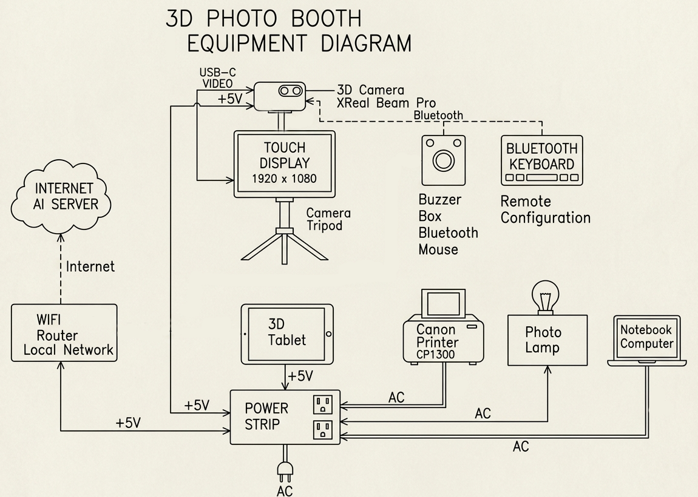

# Photo Booth

# Photo Booth Block Diagram

# Photo Booth Equipment

## XReal Beam Pro 3D Camera Tablet
This Android tablet is the 3D camera and photo booth controller.
It is connected to the local WIFI network.
It saves 3D SBS (side-by-side), anaglyph, and both left and right photos at maximum resolution taken.
It adjusts SBS and anaglyph photos for parallax and vertical alignment before saving.
The SBS images have reduced resolution because the camera has limited RAM memory for processing images.

## Buzzer Box
This is a repurposed Bluetooth mouse connected to the XReal Beam Pro. 
It used to capture photo booth images and review the results.

## Mobile Monitor 
This touch screen 1920x1080 monitor displays the photo booth live view and review photos.

## IQH3D SKYY Android Glasses Free 3D Tablet
This tablet shows captures photos from the photo booth.
It is connected to the local WIFI network and configured as a fixed static address 192.168.8.99.

## Canon CP1300 4x6 Photo Printer
The networked printer used to print photo booth images.

## Network Router
This WIFI network router connects all the devices used with the photo booth. It also connects to the Internet providers for AI Image editing services.

## Aditional Cameras
Not shown in the block diagram are other cameras that can be triggered over WIFI from the A3dCamera app when it starts to take a photo. 
This is accomplished using network broadcast messages to waiting cameras.
When these cameras are Android phones with the [MultRemoteCamera](https://sourceforge.net/p/multi-remote-camera/wiki/Home/) Android app, the photo files will have the same date/time as the corresponding A3dCamera app photo.

Other XReal Beam Pro cameras using A3dCamera can be configured to receive these broadcast messages and trigger photo captures at the same time.

## Miscellaneous
Camera tripod, brackets, cables, power adapters, and a photo lamp.

# Photo Booth Software

## A3dCamera Android App
The A3dCamera app runs on the XReal Beam Pro 3D camera tablet. It must first be configured as a photo booth. Configuration is done by commands using a keyboard.
The command is /pb true<enter>

This app does not use the touch screen for input or control. 

## Simple HTTP Server PLUS Android App
This app runs on the XReal Beam Pro. It is a HTTP server that supplies the saved photos to a networked 3D tablet or notebook computer for review.
This is the purchased app version 3.05. The app is configured to use the photo booth's local WIFI network.

## itCamera Android App
This is the app that sends prompt requests to an AI Image editing cloud service. 
Images sent to the service are reduced in size and set to 6x4 aspect ratio (for the printer).
The multimodal LLM model used for photo editing is Google "gemini-3.1-flash-image-preview" a paid service.
This app is a work in progress and is not available as open source.

AI editing is also configured by a command in the A3dCamera app.

The app uses the touch screen.

## ImageDownloader Android App
This Andrid app runs on the IGH SKYY glasses free tablet. It is connected by WIFI to the photo booth local network.
The app has a very simple HTTP server that waits for a message to download a photo from the HTTP server running on the XReal Beam Pro tablet.
Once a new photo is downloaded the app converts it to appear on the tablet screen in 3D.
It then waits for the next photo.

The app is written in Processing Android Java and is open source.
It can also run on the Android Leia tablets both 1 and 2 versions, but has to use the LeiaPlayer app is view in 3D.

The app source code can be modified easily to run on Windows, Linux, or iOS using the Processing.org IDE.
In this way other devices with 3D displays may be able to show 3D images glasses free.

It could also be used on another XReal Beam Pro with its glasses to download and view the photo booth's photos. (But I have not tested this feature)

## Notes
All the Android devices are placed in developer mode to prevent turning off when being charged
