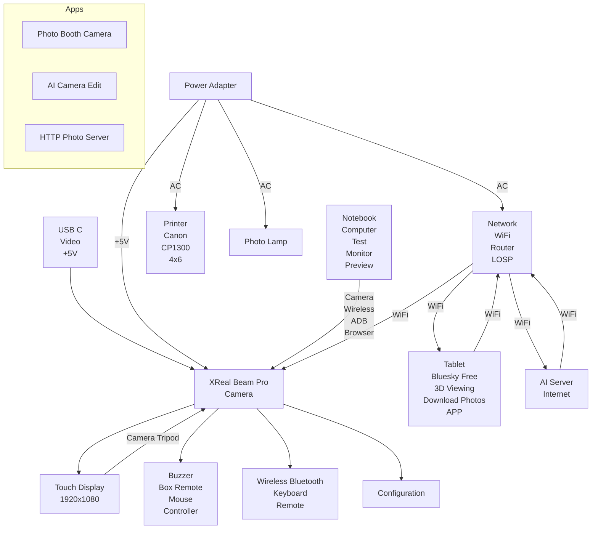

Photo Booth Equipment/Software Block Diagram

```mermaid
flowchart TD
    %% Apps in XReal Beam Pro
    subgraph Apps
        A[Photo Booth Camera]
        B[AI Camera Edit]
        C[HTTP Photo Server]
    end

    %% Main Components
    D[USB C\nVideo\n+5V] --> E[XReal Beam Pro\nCamera]
    E --> F[Touch Display\n1920x1080]
    E --> G[Buzzer\nBox Remote\nMouse\nController]
    E --> H[Wireless Bluetooth\nKeyboard\nRemote]
    E --> I[Configuration]

    %% Power and Network
    J[Power Adapter] -->|+5V| E
    J -->|AC| K[Network\nWiFi\nRouter\nLOSP]
    J -->|AC| L[Printer\nCanon\nCP1300\n4x6]
    J -->|AC| M[Photo Lamp]

    %% Additional Devices
    N[Notebook\nComputer\nTest\nMonitor\nPreview] -->|Camera\nWireless\nADB\nBrowser| E
    O[Tablet\nBluesky Free\n3D Viewing\nDownload Photos\nAPP] -->|WiFi| K
    P[AI Server\nInternet] -->|WiFi| K

    %% Connections
    K -->|WiFi| E
    K -->|WiFi| O
    K -->|WiFi| P

    %% Camera Tripod
    F -->|Camera Tripod| E
```